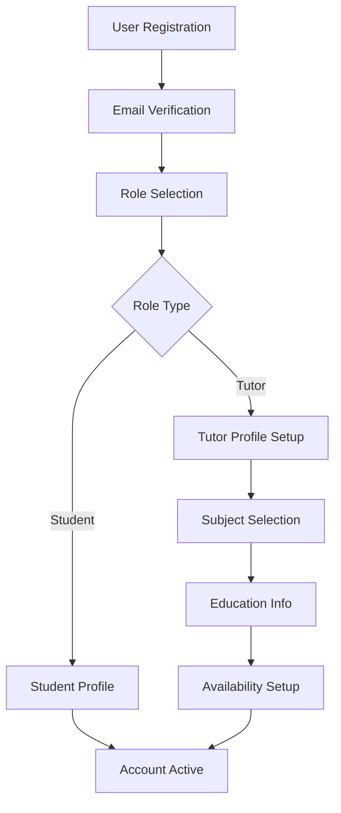
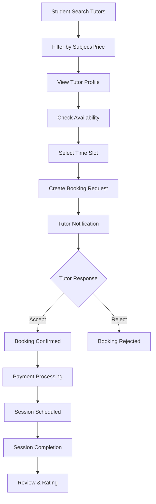
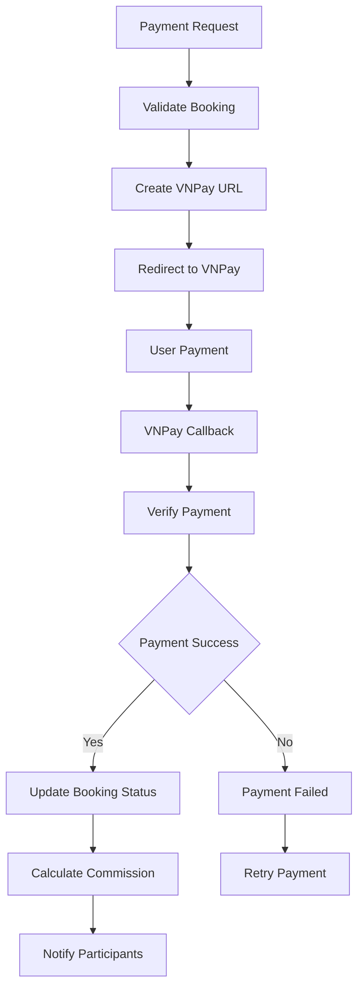

# 🏗️ Thiết kế Hệ thống Web_Booking - Chi tiết

## 🎯 **TỔNG QUAN HỆ THỐNG**

Hệ thống web_booking là một nền tảng kết nối gia sư và học viên, được xây dựng trên Laravel framework với kiến trúc MVC mở rộng theo mô hình Repository-Service Pattern.

### **Thông tin dự án:**
- **Framework**: Laravel 11.x
- **Ngôn ngữ**: PHP 8.2+
- **Cơ sở dữ liệu**: MySQL 8.0
- **Frontend**: Blade Templates + TailwindCSS + Alpine.js
- **Payment Gateway**: VNPay
- **Caching**: Redis/File Cache
- **Queue System**: Laravel Queue với Database driver

---

## 🏛️ **KIẾN TRÚC TỔNG QUAN**

### **1. Kiến trúc Phân tầng (Layered Architecture)**

```
┌─────────────────────────────────────────────────────────────────────────────────┐
│                               PRESENTATION LAYER                                │
├─────────────────────────────────────────────────────────────────────────────────┤
│                                                                                 │
│  ┌─────────────────┐    ┌─────────────────┐    ┌─────────────────┐           │
│  │   Web Routes    │    │   Controllers   │    │   View Layer    │           │
│  │                 │    │                 │    │                 │           │
│  │ • Public Routes │    │ • PageController│    │ • Blade Views   │           │
│  │ • Auth Routes   │    │ • TutorController│   │ • Components    │           │
│  │ • Admin Routes  │    │ • StudentController│ │ • Layouts       │           │
│  │ • API Routes    │    │ • BookingController│ │ • Partials      │           │
│  └─────────────────┘    └─────────────────┘    └─────────────────┘           │
│                                                                                 │
├─────────────────────────────────────────────────────────────────────────────────┤
│                                BUSINESS LAYER                                   │
├─────────────────────────────────────────────────────────────────────────────────┤
│                                                                                 │
│  ┌─────────────────┐    ┌─────────────────┐    ┌─────────────────┐           │
│  │   Services      │    │   Contracts     │    │   Policies      │           │
│  │                 │    │                 │    │                 │           │
│  │ • BookingService│    │ • ServiceInterface│  │ • BookingPolicy │           │
│  │ • TutorService  │    │ • RepositoryInterface│ • UserPolicy   │           │
│  │ • PaymentService│    │ • PaymentInterface│   │ • TutorPolicy  │           │
│  │ • AdminService  │    │ • MessageInterface│   │                 │           │
│  └─────────────────┘    └─────────────────┘    └─────────────────┘           │
│                                                                                 │
├─────────────────────────────────────────────────────────────────────────────────┤
│                                DATA ACCESS LAYER                                │
├─────────────────────────────────────────────────────────────────────────────────┤
│                                                                                 │
│  ┌─────────────────┐    ┌─────────────────┐    ┌─────────────────┐           │
│  │   Repositories  │    │   Models        │    │   Database      │           │
│  │                 │    │                 │    │                 │           │
│  │ • UserRepository│    │ • User Model    │    │ • MySQL Tables │           │
│  │ • BookingRepository│ │ • Booking Model │    │ • Migrations    │           │
│  │ • TutorRepository│   │ • Tutor Model   │    │ • Seeders       │           │
│  │ • BaseRepository│    │ • Subject Model │    │ • Indexes       │           │
│  └─────────────────┘    └─────────────────┘    └─────────────────┘           │
│                                                                                 │
└─────────────────────────────────────────────────────────────────────────────────┘
```

### **2. Dependency Injection Container**

```php
// AppServiceProvider.php - Dependency Injection Configuration
public function register(): void
{
    // Repository Bindings
    $this->app->bind(UserRepositoryInterface::class, UserRepository::class);
    $this->app->bind(BookingRepositoryInterface::class, BookingRepository::class);
    $this->app->bind(TutorRepositoryInterface::class, TutorRepository::class);
    
    // Service Bindings
    $this->app->bind(BookingServiceInterface::class, BookingService::class);
    $this->app->bind(TutorServiceInterface::class, TutorService::class);
    $this->app->bind(PaymentServiceInterface::class, PaymentService::class);
    
    // Singleton Services
    $this->app->singleton(TutorService::class, function ($app) {
        return new TutorService(
            $app->make(TutorRepository::class),
            $app->make(UserRepository::class)
        );
    });
}
```

---

## 🎭 **PHÂN TÍCH CÁC THÀNH PHẦN CHÍNH**

### **1. Controllers Layer**

#### **1.1 Phân loại Controllers**

```
Controllers/
├── PageController.php          # Trang công khai (Home, About, Pricing)
├── AuthController.php          # Xác thực người dùng
├── ProfileController.php       # Quản lý hồ sơ người dùng
├── BookingController.php       # Quản lý đặt lịch học
├── TutorController.php         # Chức năng gia sư
├── StudentController.php       # Chức năng học viên
├── PaymentController.php       # Xử lý thanh toán
├── AdminController.php         # Quản trị hệ thống
├── MessageController.php       # Tin nhắn
└── NotificationController.php  # Thông báo
```

#### **1.2 Controller Pattern**

```php
// Ví dụ: BookingController.php
class BookingController extends Controller
{
    use AuthorizesRequests;
    
    protected BookingService $bookingService;
    
    public function __construct(BookingService $bookingService)
    {
        $this->bookingService = $bookingService;
    }
    
    public function index(): View
    {
        $user = Auth::user();
        $bookings = $this->bookingService->getUserBookings($user);
        return view('bookings.index', compact('bookings'));
    }
    
    public function store(BookingRequest $request, Tutor $tutor): RedirectResponse
    {
        try {
            $booking = $this->bookingService->createBooking(
                $request->validated(), 
                $tutor, 
                Auth::user()
            );
            
            return redirect()->route('bookings.index')
                ->with('success', __('booking.success.booking_requested'));
        } catch (Exception $e) {
            return back()->withInput()->withErrors(['error' => $e->getMessage()]);
        }
    }
}
```

### **2. Services Layer**

#### **2.1 Service Pattern Implementation**

```php
// BaseService.php - Service base class
abstract class BaseService implements ServiceInterface
{
    public function executeTransaction(callable $callback)
    {
        try {
            DB::beginTransaction();
            $result = $callback();
            DB::commit();
            return $result;
        } catch (Exception $e) {
            DB::rollBack();
            Log::error(get_class($this) . ' error: ' . $e->getMessage());
            throw $e;
        }
    }
    
    public function logActivity(string $action, array $data = []): void
    {
        Log::info(get_class($this) . ': ' . $action, $data);
    }
    
    public function formatCurrency(float $amount): string
    {
        return number_format($amount, 0, '.', ',') . ' VND';
    }
}
```

#### **2.2 Các Service chính**

```
Services/
├── BookingService.php     # Quản lý đặt lịch học
├── TutorService.php       # Quản lý gia sư
├── StudentService.php     # Quản lý học viên
├── PaymentService.php     # Xử lý thanh toán
├── AdminService.php       # Quản trị hệ thống
├── MessageService.php     # Tin nhắn
├── NotificationService.php # Thông báo
├── UserService.php        # Quản lý người dùng
├── SubjectService.php     # Quản lý môn học
└── VnpayService.php       # Tích hợp VNPay
```

### **3. Repository Layer**

#### **3.1 Repository Pattern**

```php
// BaseRepository.php - Repository base class
abstract class BaseRepository implements RepositoryInterface
{
    protected $model;
    protected $query;
    
    public function __construct(Model $model)
    {
        $this->model = $model;
        $this->resetQuery();
    }
    
    protected function query(): Builder
    {
        return $this->model->newQuery();
    }
    
    public function findById(int $id): ?Model
    {
        return $this->query()->find($id);
    }
    
    public function create(array $data): Model
    {
        return $this->model->create($data);
    }
    
    public function update(int $id, array $data): bool
    {
        $model = $this->findById($id);
        return $model ? $model->update($data) : false;
    }
    
    public function paginate(int $perPage = 15): LengthAwarePaginator
    {
        $result = $this->query->paginate($perPage);
        $this->resetQuery();
        return $result;
    }
}
```

#### **3.2 Repository Implementations**

```php
// TutorRepository.php - Specific repository
class TutorRepository extends BaseRepository implements TutorRepositoryInterface
{
    public function getTutorsWithFilters(array $filters = []): LengthAwarePaginator
    {
        $query = $this->query()
            ->with(['user:id,name,email,avatar', 'subjects:id,name,icon'])
            ->withCount('reviews')
            ->withAvg('reviews', 'rating')
            ->where('is_available', true);
            
        // Apply filters
        $query = $this->applyFilters($query, $filters);
        $query = $this->applySorting($query, $filters['sort'] ?? null);
        
        return $query->paginate($filters['per_page'] ?? 12);
    }
    
    protected function applyFilters(Builder $query, array $filters): Builder
    {
        if (!empty($filters['subject'])) {
            $query->whereHas('subjects', function ($q) use ($filters) {
                $q->where('subjects.id', $filters['subject']);
            });
        }
        
        if (!empty($filters['price_range'])) {
            $range = explode('-', $filters['price_range']);
            if (count($range) === 2) {
                $query->whereBetween('hourly_rate', [$range[0], $range[1]]);
            }
        }
        
        return $query;
    }
}
```

### **4. Models Layer**

#### **4.1 Model Relationships**

```php
// User.php - Main user model
class User extends Authenticatable
{
    protected $fillable = [
        'name', 'email', 'password', 'role', 'avatar', 
        'phone_number', 'address', 'account_status'
    ];
    
    protected $casts = [
        'email_verified_at' => 'datetime',
        'password' => 'hashed',
    ];
    
    // Relationships
    public function tutor()
    {
        return $this->hasOne(Tutor::class);
    }
    
    public function studentBookings()
    {
        return $this->hasMany(Booking::class, 'student_id');
    }
    
    public function tutorBookings()
    {
        return $this->hasMany(Booking::class, 'tutor_id');
    }
    
    public function reviewsGiven()
    {
        return $this->hasMany(Review::class, 'student_id');
    }
    
    public function reviewsReceived()
    {
        return $this->hasMany(Review::class, 'tutor_id');
    }
}
```

#### **4.2 Booking Model - Core Business Logic**

```php
// Booking.php - Core booking model
class Booking extends Model
{
    // Status constants
    public const STATUS_PENDING = 'pending';
    public const STATUS_CONFIRMED = 'confirmed';
    public const STATUS_CANCELLED = 'cancelled';
    public const STATUS_COMPLETED = 'completed';
    
    protected $fillable = [
        'student_id', 'tutor_id', 'subject_id', 'start_time', 'end_time',
        'is_confirmed', 'is_cancelled', 'is_completed', 'price',
        'payment_method', 'payment_at', 'notes'
    ];
    
    protected $casts = [
        'start_time' => 'datetime',
        'end_time' => 'datetime',
        'is_confirmed' => 'boolean',
        'is_cancelled' => 'boolean',
        'is_completed' => 'boolean',
        'price' => 'decimal:2',
        'payment_at' => 'datetime',
    ];
    
    // Relationships
    public function student()
    {
        return $this->belongsTo(User::class, 'student_id');
    }
    
    public function tutor()
    {
        return $this->belongsTo(Tutor::class);
    }
    
    public function subject()
    {
        return $this->belongsTo(Subject::class);
    }
    
    // Scopes
    public function scopePending($query)
    {
        return $query->where('is_confirmed', false)
                    ->where('is_cancelled', false)
                    ->where('is_completed', false);
    }
    
    public function scopeCompleted($query)
    {
        return $query->where('is_completed', true);
    }
    
    // Attributes
    public function getDurationAttribute()
    {
        if (!$this->start_time || !$this->end_time) {
            return 0;
        }
        
        return $this->start_time->diffInMinutes($this->end_time);
    }
}
```

---

## 🔄 **LUỒNG NGHIỆP VỤ CHÍNH**

### **1. Luồng Đăng ký & Xác thực**



### **2. Luồng Đặt lịch học**



### **3. Luồng Thanh toán VNPay**



---

## 🗃️ **THIẾT KẾ CƠ SỞ DỮ LIỆU**

### **1. Cấu trúc Tables chính**

```sql
-- Users table - Bảng người dùng chính
CREATE TABLE users (
    id BIGINT PRIMARY KEY AUTO_INCREMENT,
    name VARCHAR(255) NOT NULL,
    email VARCHAR(255) UNIQUE NOT NULL,
    password VARCHAR(255) NOT NULL,
    role ENUM('student', 'tutor', 'admin') NOT NULL DEFAULT 'student',
    avatar VARCHAR(255),
    phone_number VARCHAR(20),
    address TEXT,
    account_status ENUM('active', 'suspended', 'inactive') DEFAULT 'active',
    email_verified_at TIMESTAMP NULL,
    created_at TIMESTAMP DEFAULT CURRENT_TIMESTAMP,
    updated_at TIMESTAMP DEFAULT CURRENT_TIMESTAMP ON UPDATE CURRENT_TIMESTAMP,
    
    INDEX idx_email (email),
    INDEX idx_role (role),
    INDEX idx_status (account_status)
);

-- Tutors table - Bảng thông tin gia sư
CREATE TABLE tutors (
    id BIGINT PRIMARY KEY AUTO_INCREMENT,
    user_id BIGINT NOT NULL,
    bio TEXT,
    hourly_rate DECIMAL(10,2) NOT NULL,
    experience_years INT DEFAULT 0,
    specialization VARCHAR(255),
    is_available BOOLEAN DEFAULT true,
    created_at TIMESTAMP DEFAULT CURRENT_TIMESTAMP,
    updated_at TIMESTAMP DEFAULT CURRENT_TIMESTAMP ON UPDATE CURRENT_TIMESTAMP,
    
    FOREIGN KEY (user_id) REFERENCES users(id) ON DELETE CASCADE,
    INDEX idx_user_id (user_id),
    INDEX idx_hourly_rate (hourly_rate),
    INDEX idx_available (is_available)
);

-- Bookings table - Bảng đặt lịch học
CREATE TABLE bookings (
    id BIGINT PRIMARY KEY AUTO_INCREMENT,
    student_id BIGINT NOT NULL,
    tutor_id BIGINT NOT NULL,
    subject_id BIGINT NOT NULL,
    start_time DATETIME NOT NULL,
    end_time DATETIME NOT NULL,
    price DECIMAL(10,2) NOT NULL,
    is_confirmed BOOLEAN DEFAULT false,
    is_cancelled BOOLEAN DEFAULT false,
    is_completed BOOLEAN DEFAULT false,
    payment_method VARCHAR(50),
    payment_at DATETIME,
    notes TEXT,
    created_at TIMESTAMP DEFAULT CURRENT_TIMESTAMP,
    updated_at TIMESTAMP DEFAULT CURRENT_TIMESTAMP ON UPDATE CURRENT_TIMESTAMP,
    
    FOREIGN KEY (student_id) REFERENCES users(id) ON DELETE CASCADE,
    FOREIGN KEY (tutor_id) REFERENCES tutors(id) ON DELETE CASCADE,
    FOREIGN KEY (subject_id) REFERENCES subjects(id) ON DELETE CASCADE,
    
    INDEX idx_student_id (student_id),
    INDEX idx_tutor_id (tutor_id),
    INDEX idx_subject_id (subject_id),
    INDEX idx_start_time (start_time),
    INDEX idx_status (is_confirmed, is_cancelled, is_completed),
    INDEX idx_payment (payment_at)
);
```

### **2. Relationships và Indexes**

```sql
-- Performance indexes
CREATE INDEX idx_bookings_tutor_time ON bookings(tutor_id, start_time);
CREATE INDEX idx_bookings_student_time ON bookings(student_id, start_time);
CREATE INDEX idx_reviews_tutor_rating ON reviews(tutor_id, rating);
CREATE INDEX idx_availability_tutor_day ON availability(tutor_id, day_of_week, is_available);

-- Composite indexes cho các truy vấn phổ biến
CREATE INDEX idx_tutors_available_rate ON tutors(is_available, hourly_rate);
CREATE INDEX idx_bookings_status_time ON bookings(is_confirmed, is_cancelled, start_time);
```

### **3. Database Schema Visualization**

```
┌─────────────────────────────────────────────────────────────────────────────────┐
│                             DATABASE SCHEMA                                     │
├─────────────────────────────────────────────────────────────────────────────────┤
│                                                                                 │
│     ┌─────────────┐    ┌─────────────┐    ┌─────────────┐                     │
│     │   USERS     │    │   TUTORS    │    │  SUBJECTS   │                     │
│     │             │    │             │    │             │                     │
│     │ • id        │◄───┤ • user_id   │    │ • id        │                     │
│     │ • name      │    │ • bio       │    │ • name      │                     │
│     │ • email     │    │ • hourly_rate│   │ • description│                    │
│     │ • role      │    │ • experience │   │ • is_active │                     │
│     │ • status    │    │ • available │    │             │                     │
│     └─────────────┘    └─────────────┘    └─────────────┘                     │
│            │                   │                   │                           │
│            │                   │                   │                           │
│            ▼                   ▼                   ▼                           │
│     ┌─────────────┐    ┌─────────────┐    ┌─────────────┐                     │
│     │  BOOKINGS   │    │  EDUCATION  │    │SUBJECT_TUTOR│                     │
│     │             │    │             │    │             │                     │
│     │ • student_id│◄───┤ • tutor_id  │    │ • subject_id│                     │
│     │ • tutor_id  │    │ • degree    │    │ • tutor_id  │                     │
│     │ • subject_id│    │ • institution│   │ • hourly_rate│                    │
│     │ • start_time│    │ • year      │    │             │                     │
│     │ • end_time  │    │ • images    │    │             │                     │
│     │ • price     │    │             │    │             │                     │
│     │ • status    │    │             │    │             │                     │
│     └─────────────┘    └─────────────┘    └─────────────┘                     │
│            │                                                                   │
│            ▼                                                                   │
│     ┌─────────────┐    ┌─────────────┐    ┌─────────────┐                     │
│     │  REVIEWS    │    │TRANSACTIONS │    │ MESSAGES    │                     │
│     │             │    │             │    │             │                     │
│     │ • booking_id│    │ • booking_id│    │ • sender_id │                     │
│     │ • student_id│    │ • amount    │    │ • receiver_id│                    │
│     │ • tutor_id  │    │ • method    │    │ • content   │                     │
│     │ • rating    │    │ • status    │    │ • read_at   │                     │
│     │ • comment   │    │ • gateway_id│    │             │                     │
│     └─────────────┘    └─────────────┘    └─────────────┘                     │
│                                                                                 │
└─────────────────────────────────────────────────────────────────────────────────┘
```

---

## 🔒 **BẢO MẬT & AUTHORIZATION**

### **1. Authentication System**

```php
// User Authentication Flow
class AuthController extends Controller
{
    public function login(Request $request)
    {
        $credentials = $request->validate([
            'email' => 'required|email',
            'password' => 'required'
        ]);
        
        if (Auth::attempt($credentials)) {
            $request->session()->regenerate();
            
            // Log security event
            LogService::security('User logged in', [
                'user_id' => Auth::id(),
                'ip' => $request->ip(),
                'user_agent' => $request->userAgent()
            ]);
            
            return redirect()->intended('/dashboard');
        }
        
        return back()->withErrors([
            'email' => 'The provided credentials do not match our records.',
        ]);
    }
}
```

### **2. Authorization Policies**

```php
// BookingPolicy.php - Authorization rules
class BookingPolicy
{
    public function view(User $user, Booking $booking): bool
    {
        return $user->id === $booking->student_id || 
               $user->tutor?->id === $booking->tutor_id ||
               $user->role === 'admin';
    }
    
    public function update(User $user, Booking $booking): bool
    {
        // Only tutor can accept/reject bookings
        return $user->tutor?->id === $booking->tutor_id;
    }
    
    public function cancel(User $user, Booking $booking): bool
    {
        // Both student and tutor can cancel
        return $user->id === $booking->student_id || 
               $user->tutor?->id === $booking->tutor_id;
    }
}
```

### **3. Role-based Access Control**

```php
// RoleSwitchMiddleware.php - Role management
class RoleSwitchMiddleware
{
    public function handle(Request $request, Closure $next, string $role): Response
    {
        $user = Auth::user();
        
        if (!$user) {
            return redirect()->route('login');
        }
        
        // Check if user has required role
        if ($user->role !== $role) {
            abort(403, 'Insufficient permissions');
        }
        
        // Additional checks for tutor role
        if ($role === 'tutor' && !$user->tutor) {
            return redirect()->route('profile.edit')
                ->with('error', 'Please complete your tutor profile first');
        }
        
        return $next($request);
    }
}
```

---

## 💳 **PAYMENT SYSTEM**

### **1. VNPay Integration**

```php
// VnpayService.php - Payment gateway
class VnpayService
{
    public function createPaymentUrl(Booking $booking, string $returnUrl): string
    {
        $vnpay_Url = config('services.vnpay.url');
        $vnpay_Returnurl = $returnUrl;
        $vnpay_TmnCode = config('services.vnpay.tmn_code');
        $vnpay_HashSecret = config('services.vnpay.hash_secret');
        
        $inputData = [
            "vnp_Version" => "2.1.0",
            "vnp_TmnCode" => $vnpay_TmnCode,
            "vnp_Amount" => $booking->price * 100,
            "vnp_Command" => "pay",
            "vnp_CreateDate" => date('YmdHis'),
            "vnp_CurrCode" => "VND",
            "vnp_IpAddr" => request()->ip(),
            "vnp_Locale" => "vn",
            "vnp_OrderInfo" => "Thanh toan hoc phi - " . $booking->id,
            "vnp_OrderType" => "billpayment",
            "vnp_ReturnUrl" => $vnpay_Returnurl,
            "vnp_TxnRef" => $booking->id . '_' . time(),
        ];
        
        ksort($inputData);
        $query = http_build_query($inputData);
        $vnpay_Url .= "?" . $query;
        
        $vnp_SecureHash = hash_hmac('sha512', $query, $vnpay_HashSecret);
        $vnpay_Url .= '&vnp_SecureHash=' . $vnp_SecureHash;
        
        return $vnpay_Url;
    }
    
    public function verifyPayment(array $params): bool
    {
        $vnp_HashSecret = config('services.vnpay.hash_secret');
        $vnp_SecureHash = $params['vnp_SecureHash'];
        
        unset($params['vnp_SecureHash']);
        ksort($params);
        
        $query = http_build_query($params);
        $secureHash = hash_hmac('sha512', $query, $vnp_HashSecret);
        
        return $secureHash === $vnp_SecureHash;
    }
}
```

### **2. Payment Processing Flow**

```php
// PaymentController.php - Payment handling
class PaymentController extends Controller
{
    public function processPayment(Request $request, Booking $booking): JsonResponse
    {
        try {
            // Validate booking status
            $this->validateBookingForPayment($booking);
            
            // Create VNPay payment URL
            $paymentUrl = $this->vnpayService->createPaymentUrl(
                $booking,
                route('payments.vnpay.return')
            );
            
            // Log payment initiation
            LogService::payment('Payment initiated', [
                'booking_id' => $booking->id,
                'amount' => $booking->price,
                'payment_method' => 'vnpay'
            ]);
            
            return response()->json([
                'success' => true,
                'payment_url' => $paymentUrl
            ]);
            
        } catch (Exception $e) {
            LogService::payment('Payment failed', [
                'booking_id' => $booking->id,
                'error' => $e->getMessage()
            ], 'error');
            
            return response()->json([
                'success' => false,
                'message' => $e->getMessage()
            ], 400);
        }
    }
    
    public function vnpayReturn(Request $request): RedirectResponse
    {
        $params = $request->all();
        
        if (!$this->vnpayService->verifyPayment($params)) {
            return redirect()->route('bookings.index')
                ->with('error', 'Payment verification failed');
        }
        
        if ($params['vnp_ResponseCode'] === '00') {
            // Payment successful
            $this->processSuccessfulPayment($params);
            return redirect()->route('bookings.index')
                ->with('success', 'Payment completed successfully');
        } else {
            // Payment failed
            return redirect()->route('bookings.index')
                ->with('error', 'Payment was not successful');
        }
    }
}
```

---

## 📊 **CACHING STRATEGY**

### **1. Cache Implementation**

```php
// CacheService.php - Centralized caching
class CacheService
{
    public const TTL_SHORT = 300;   // 5 minutes
    public const TTL_MEDIUM = 1800; // 30 minutes
    public const TTL_LONG = 3600;   // 1 hour
    
    public static function tutorDetailsKey(int $tutorId): string
    {
        return "tutor_details_{$tutorId}";
    }
    
    public static function clearTutorCaches(int $tutorId): void
    {
        Cache::forget(self::tutorDetailsKey($tutorId));
        Cache::forget("tutor_stats_{$tutorId}");
        Cache::forget("tutor_reviews_{$tutorId}");
    }
    
    public static function remember(string $key, int $ttl, callable $callback)
    {
        return Cache::remember($key, $ttl, $callback);
    }
}
```

### **2. Service Layer Caching**

```php
// TutorService.php - Service with caching
class TutorService extends BaseService
{
    public function getTutorDetails(int $tutorId): ?Tutor
    {
        $cacheKey = CacheService::tutorDetailsKey($tutorId);
        
        return CacheService::remember($cacheKey, CacheService::TTL_LONG, function () use ($tutorId) {
            return $this->tutorRepository->getTutorWithDetails($tutorId);
        });
    }
    
    public function getTutorStatistics(int $tutorId): array
    {
        $cacheKey = "tutor_stats_{$tutorId}";
        
        return CacheService::remember($cacheKey, CacheService::TTL_MEDIUM, function () use ($tutorId) {
            $stats = $this->tutorRepository->getTutorStatistics($tutorId);
            
            if (!empty($stats)) {
                $stats['formatted_total_earnings'] = $this->formatCurrency($stats['total_earnings'] ?? 0);
                $stats['formatted_average_rating'] = number_format($stats['average_rating'] ?? 0, 1);
            }
            
            return $stats;
        });
    }
}
```

---

## 🔍 **LOGGING & MONITORING**

### **1. Structured Logging**

```php
// LogService.php - Centralized logging
class LogService
{
    public static function payment(string $message, array $context = [], string $level = 'info'): void
    {
        $enrichedContext = self::enrichContext($context, [
            'channel' => 'payment',
            'user_id' => Auth::id(),
            'session_id' => session()->getId(),
        ]);
        
        Log::channel('payment')->{$level}($message, $enrichedContext);
    }
    
    public static function security(string $message, array $context = [], string $level = 'warning'): void
    {
        $enrichedContext = self::enrichContext($context, [
            'channel' => 'security',
            'user_id' => Auth::id(),
            'ip_address' => request()->ip(),
            'user_agent' => request()->userAgent(),
        ]);
        
        Log::channel('security')->{$level}($message, $enrichedContext);
    }
    
    public static function booking(string $message, array $context = [], string $level = 'info'): void
    {
        $enrichedContext = self::enrichContext($context, [
            'channel' => 'booking',
            'user_id' => Auth::id(),
            'session_id' => session()->getId(),
        ]);
        
        Log::channel('booking')->{$level}($message, $enrichedContext);
    }
    
    private static function enrichContext(array $context, array $defaultContext): array
    {
        return array_merge($defaultContext, [
            'timestamp' => now()->toISOString(),
            'memory_usage' => memory_get_usage(true),
            'execution_time' => microtime(true) - LARAVEL_START,
        ], $context);
    }
}
```

### **2. Performance Monitoring**

```php
// Performance tracking middleware
class PerformanceMiddleware
{
    public function handle(Request $request, Closure $next): Response
    {
        $start = microtime(true);
        
        $response = $next($request);
        
        $duration = microtime(true) - $start;
        
        LogService::performance('Request processed', [
            'url' => $request->url(),
            'method' => $request->method(),
            'duration' => $duration,
            'memory_peak' => memory_get_peak_usage(true),
            'status_code' => $response->status(),
        ]);
        
        return $response;
    }
}
```

---

## 🎯 **BEST PRACTICES & CONVENTIONS**

### **1. Code Quality Standards**

```php
// Example of following PSR-12 standards
class BookingService extends BaseService implements BookingServiceInterface
{
    /**
     * Create new booking with validation.
     */
    public function createBooking(array $data, Tutor $tutor, User $student): Booking
    {
        return $this->executeTransaction(function () use ($data, $tutor, $student) {
            // Validate business rules
            $this->validateBookingConstraints($data);
            
            // Calculate price
            $price = $this->calculateBookingPrice($data, $tutor);
            
            // Create booking
            $booking = Booking::create([
                'student_id' => $student->id,
                'tutor_id' => $tutor->id,
                'subject_id' => $data['subject_id'],
                'start_time' => Carbon::parse($data['start_time']),
                'end_time' => Carbon::parse($data['end_time']),
                'price' => $price,
                'notes' => $data['notes'] ?? null,
            ]);
            
            // Send notifications
            $this->sendBookingNotifications($booking);
            
            // Log activity
            $this->logActivity('Booking created', [
                'booking_id' => $booking->id,
                'student_id' => $student->id,
                'tutor_id' => $tutor->id,
            ]);
            
            return $booking;
        });
    }
}
```

### **2. Error Handling Strategy**

```php
// Centralized error handling
trait HandlesControllerErrors
{
    protected function handleWebException(Exception $e, string $view, array $data = [], string $message = null): View
    {
        Log::error('Controller error: ' . $e->getMessage(), [
            'exception' => $e,
            'user_id' => Auth::id(),
            'url' => request()->url(),
        ]);
        
        return view($view, $data)->with('error', $message ?? 'An error occurred');
    }
    
    protected function handleJsonException(Exception $e, string $message = null): JsonResponse
    {
        Log::error('API error: ' . $e->getMessage(), [
            'exception' => $e,
            'user_id' => Auth::id(),
            'url' => request()->url(),
        ]);
        
        return response()->json([
            'success' => false,
            'message' => $message ?? 'An error occurred'
        ], 500);
    }
}
```

---

## 🚀 **DEPLOYMENT & SCALING**

### **1. Environment Configuration**

```php
// config/app.php - Environment-specific settings
'environments' => [
    'production' => [
        'app_debug' => false,
        'cache_driver' => 'redis',
        'session_driver' => 'redis',
        'queue_driver' => 'redis',
    ],
    'staging' => [
        'app_debug' => false,
        'cache_driver' => 'file',
        'session_driver' => 'database',
        'queue_driver' => 'database',
    ],
    'development' => [
        'app_debug' => true,
        'cache_driver' => 'file',
        'session_driver' => 'file',
        'queue_driver' => 'sync',
    ]
],
```

### **2. Performance Optimization**

```php
// Database optimization
// config/database.php
'mysql' => [
    'driver' => 'mysql',
    'host' => env('DB_HOST', '127.0.0.1'),
    'port' => env('DB_PORT', '3306'),
    'database' => env('DB_DATABASE', 'forge'),
    'username' => env('DB_USERNAME', 'forge'),
    'password' => env('DB_PASSWORD', ''),
    'charset' => 'utf8mb4',
    'collation' => 'utf8mb4_unicode_ci',
    'prefix' => '',
    'strict' => true,
    'engine' => 'InnoDB',
    'options' => [
        PDO::ATTR_EMULATE_PREPARES => false,
        PDO::ATTR_STRINGIFY_FETCHES => false,
        PDO::MYSQL_ATTR_USE_BUFFERED_QUERY => false,
    ],
],
```

---

## 📝 **TỔNG KẾT**

Hệ thống web_booking được thiết kế với kiến trúc:

### **Ưu điểm:**
1. **Separation of Concerns**: Tách biệt rõ ràng giữa các tầng
2. **Scalability**: Dễ dàng mở rộng với Repository-Service Pattern
3. **Maintainability**: Code dễ bảo trì và test
4. **Security**: Implement đầy đủ authentication, authorization
5. **Performance**: Caching strategy và database optimization
6. **Monitoring**: Comprehensive logging và error tracking

### **Công nghệ sử dụng:**
- **Backend**: Laravel 11.x với PHP 8.2+
- **Frontend**: Blade + TailwindCSS + Alpine.js
- **Database**: MySQL với optimization indexes
- **Payment**: VNPay integration
- **Caching**: Redis/File-based caching
- **Logging**: Structured logging với multiple channels

### **Khả năng mở rộng:**
- Microservices architecture ready
- API-first design
- Queue system cho background jobs
- Horizontal scaling support
- Multi-language support

---

*Tài liệu này mô tả chi tiết thiết kế hệ thống web_booking, phục vụ cho việc phát triển, bảo trì và mở rộng hệ thống.*

**Cập nhật lần cuối:** 17 tháng 7, 2025